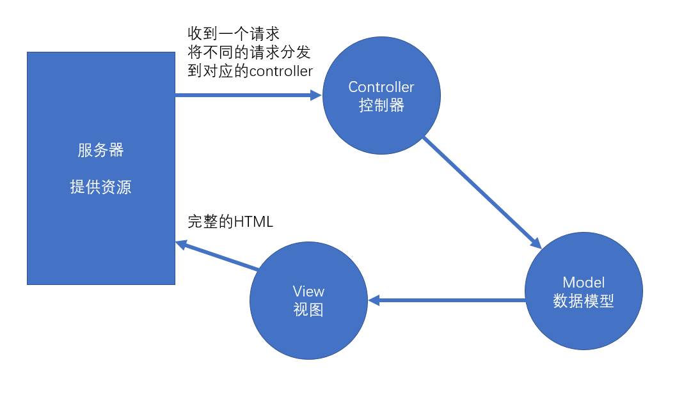

# Redux核心概念

action  reducer  store

## MVC

它是一个UI的解决方案，用于降低UI，以及UI关联的数据的复杂度。

**传统的服务器端的MVC**


环境：

1. 服务端需要响应一个完整的HTML
2. 该HTML中包含页面需要的数据
3. 浏览器仅承担渲染页面的作用

以上的这种方式叫做**服务端渲染**，即服务器端将完整的页面组装好之后，一起发送给客户端。

服务器端需要处理UI中要用到的数据，并且要将数据嵌入到页面中，最终生成一个完整的HTML页面响应。

为了降低处理这个过程的复杂度，出现了MVC模式。



**Controller**: 处理请求，组装这次请求需要的数据
**Model**：需要用于UI渲染的数据模型
**View**：视图，用于将模型组装到界面中


**前端MVC模式的困难**

React解决了   数据 -> 视图   的问题

1. 前端的controller要比服务器复杂很多，因为前端中的controller处理的是用户的操作，而用户的操作场景是复杂的。
2. 对于那些组件化的框架（比如vue、react），它们使用的是单向数据流。若需要共享数据，则必须将数据提升到顶层组件，然后数据再一层一层传递，极其繁琐。 虽然可以使用上下文来提供共享数据，但对数据的操作难以监控，容易导致调试错误的困难，以及数据还原的困难。并且，若开发一个大中型项目，共享的数据很多，会导致上下文中的数据变得非常复杂。

比如，上下文中有如下格式的数据：

```js
value = {
    users:[{},{},{}],
    addUser: function(u){},
    deleteUser: function(u){},
    updateUser: function(u){}
}
```


## 前端需要一个独立的数据解决方案

**Flux**

Facebook提出的数据解决方案，它的最大历史意义，在于它引入了action的概念

action是一个普通的对象，用于描述要干什么。**action是触发数据变化的唯一原因**

store表示数据仓库，用于存储共享数据。还可以根据不同的action更改仓库中的数据

示例：

```js
var loginAction = {
    type: "login",
    payload: {
        loginId:"admin",
        loginPwd:"123123"
    }
}

var deleteAction = {
    type: "delete",
    payload: 1  // 用户id为1
}
```

## Redux

在Flux基础上，引入了reducer的概念

reducer：处理器，用于根据action来处理数据，处理后的数据会被仓库重新保存。


### Action

1. action是一个plain-object（平面对象）
   1. 它的__proto__指向Object.prototype
2. 通常，使用payload属性表示附加数据（没有强制要求）
3. action中必须有type属性，该属性用于描述操作的类型
   1. 但是，没有对type的类型做出要求
4. 在大型项目，由于操作类型非常多，为了避免硬编码（hard code），会将action的类型存放到一个或一些单独的文件中(样板代码)。
5. 为了方面传递action，通常会使用action创建函数(action creator)来创建action
   1. action创建函数应为无副作用的纯函数
      1. 不能以任何形式改动参数
      2. 不可以有异步
      3. 不可以对外部环境中的数据造成影响
6. 为了方便利用action创建函数来分发（触发）action，redux提供了一个函数```bindActionCreators```，该函数用于增强action创建函数的功能，使它不仅可以创建action，并且创建后会自动完成分发。

### Reducer

Reducer是用于改变数据的函数

1. 一个数据仓库，有且仅有一个reducer，并且通常情况下，一个工程只有一个仓库，因此，一个系统，只有一个reducer
2. 为了方便管理，通常会将reducer放到单独的文件中。
3. reducer被调用的时机
   1. 通过store.dispatch，分发了一个action，此时，会调用reducer
   2. 当创建一个store的时候，会调用一次reducer
      1. 可以利用这一点，用reducer初始化状态
      2. 创建仓库时，不传递任何默认状态
      3. 将reducer的参数state设置一个默认值
4. reducer内部通常使用switch来判断type值
5. **reducer必须是一个没有副作用的纯函数**
   1. 为什么需要纯函数
      1. 纯函数有利于测试和调式
      2. 有利于还原数据
      3. 有利于将来和react结合时的优化
   2. 具体要求
      1. 不能改变参数，因此若要让状态变化，必须得到一个新的状态
      2. 不能有异步
      3. 不能对外部环境造成影响
6. 由于在大中型项目中，操作比较复杂，数据结构也比较复杂，因此，需要对reducer进行细分。
   1. redux提供了方法，可以帮助我们更加方便的合并reducer
   2. combineReducers: 合并reducer，得到一个新的reducer，该新的reducer管理一个对象，该对象中的每一个属性交给对应的reducer管理。

### Store

Store：用于保存数据

通过createStore方法创建的对象。

该对象的成员：

- dispatch：分发一个action
- getState：得到仓库中当前的状态
- replaceReducer：替换掉当前的reducer
- subscribe：注册一个监听器，监听器是一个无参函数，分发一个action之后，会运行注册的监听器。该函数会返回一个函数，用于取消监听

### createStore 

返回一个对象：

- dispatch：分发一个action
- getState：得到仓库中当前的状态
- subscribe：注册一个监听器，监听器是一个无参函数，该分发一个action之后，会运行注册的监听器。该函数会返回一个函数，用于取消监听

### combineReducers

组装reducers，返回一个reducer，数据使用一个对象表示，对象的属性名与传递的参数对象保持一致

## Redux中间件（Middleware）

中间件：类似于插件，可以在不影响原本功能、并且不改动原本代码的基础上，对其功能进行增强。在Redux中，中间件主要用于增强dispatch函数。

实现Redux中间件的基本原理，是更改仓库中的dispatch函数。

Redux中间件书写：

- 中间件本身是一个函数，该函数接收一个store参数，表示创建的仓库，该仓库并非一个完整的仓库对象，仅包含getState，dispatch。该函数运行的时间，是在仓库创建之后运行。
  - 由于创建仓库后需要自动运行设置的中间件函数，因此，需要在创建仓库时，告诉仓库有哪些中间件
  - 需要调用applyMiddleware函数，将函数的返回结果作为createStore的第二或第三个参数。
- 中间件函数必须返回一个dispatch创建函数


- applyMiddleware函数，用于记录有哪些中间件，它会返回一个函数
  - 该函数用于记录创建仓库的方法，然后又返回一个函数

### 手写applyMiddleware

middleware的本质，是一个调用后可以得到dispatch创建函数的函数

compose：函数组合，将一个数组中的函数进行组合，形成一个新的函数，该函数调用时，实际上是反向调用之前组合的函数

## 迭代器和可迭代协议

> 解决副作用的 redux 中间件
> redux-thunk：需要改动action，可接收action是一个函数
> redux-promise：需要改动action，可接收action是一个promise对象，或action的payload是一个promise对象
> 以上两个中间件，会导致action或action创建函数不再纯净。
> redux-saga将解决这样的问题，它不仅可以保持action、action创建函数、reducer的纯净，而且可以用模块化的方式解决副作用，并且功能非常强大。
> redux-saga是建立在ES6的生成器基础上的，要熟练的使用saga，必须理解生成器。
> 要理解生成器，必须先理解迭代器和可迭代协议。

### 迭代

类似于遍历

遍历：有多个数据组成的集合数据结构（map、set、array等其他类数组），需要从该结构中依次取出数据进行某种处理。

迭代：按照某种逻辑，依次取出下一个数据进行处理。

### 迭代器 iterator

JS语言规定，如果一个对象具有next方法，并且next方法满足一定的约束，则该对象是一个迭代器（iterator）。

next方法的约束：该方法必须返回一个对象，该对象至少具有两个属性：

- value：any类型，下一个数据的值，如果done属性为true，通常，会将value设置为undefined
- done：bool类型，是否已经迭代完成

通过迭代器的next方法，可以依次取出数据，并可以根据返回的done属性，判定是否迭代结束。

#### 迭代器创建函数 iterator creator

它是指一个函数，调用该函数后，返回一个迭代器，则该函数称之为迭代器创建函数，可以简称位迭代器函数。


### 可迭代协议

ES6中出现了for-of循环，该循环就是用于迭代某个对象的，因此，for-of循环要求对象必须是可迭代的（对象必须满足可迭代协议）

可迭代协议是用于约束一个对象的，如果一个对象满足下面的规范，则该对象满足可迭代协议，也称之为该对象是可以被迭代的。

可迭代协议的约束如下：

1. 对象必须有一个知名符号属性（Symbol.iterator）
2. 该属性必须是一个无参的迭代器创建函数

### for-of循环的原理

调用对象的[Symbol.iterator]方法，得到一个迭代器。不断调用next方法，只有返回的done为false，则将返回的value传递给变量，然后进入循环体执行一次。

### redux-saga

> 中文文档地址：https://redux-saga-in-chinese.js.org/

- 纯净
- 强大
- 灵活


在saga任务中，如果yield了一个普通数据，saga不作任何处理，仅仅将数据传递给yield表达式（把得到的数据放到next的参数中），因此，在saga中，yield一个普通数据没什么意义。

saga需要你在yield后面放上一些合适的saga指令（saga effects），如果放的是指令，saga中间件会根据不同的指令进行特殊处理，以控制整个任务的流程。

每个指令本质上就是一个函数，该函数调用后，会返回一个指令对象，saga会接收到该指令对象，进行各种处理

**一旦saga任务完成（生成器函数运行完成），则saga中间件一定结束**

- take指令：【阻塞】监听某个action，如果action发生了，则会进行下一步处理，take指令仅监听一次。yield得到的是完整的action对象
- all指令：【阻塞】该函数传入一个数组，数组中放入生成器，saga会等待所有的生成器全部完成后才会进一步处理
- takeEvery指令：不断的监听某个action，当某个action到达之后，运行一个函数。takeEvery永远不会结束当前的生成器
- delay指令：【阻塞】阻塞指定的毫秒数
- put指令：用于重新触发action，相当于dispatch一个action
- call指令：【可能阻塞】用于副作用（通常是异步）函数调用
- apply指令：【可能阻塞】用于副作用（通常是异步）函数调用
- select指令：用于得到当前仓库中的数据
- cps指令：【可能阻塞】用于调用那些传统的回调方式的异步函数